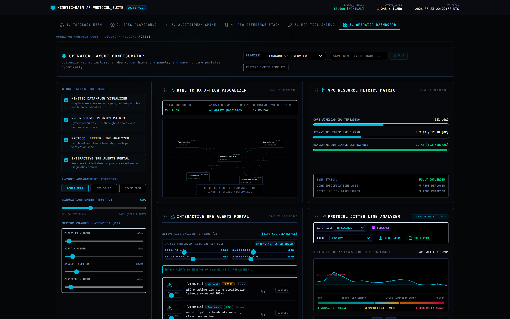
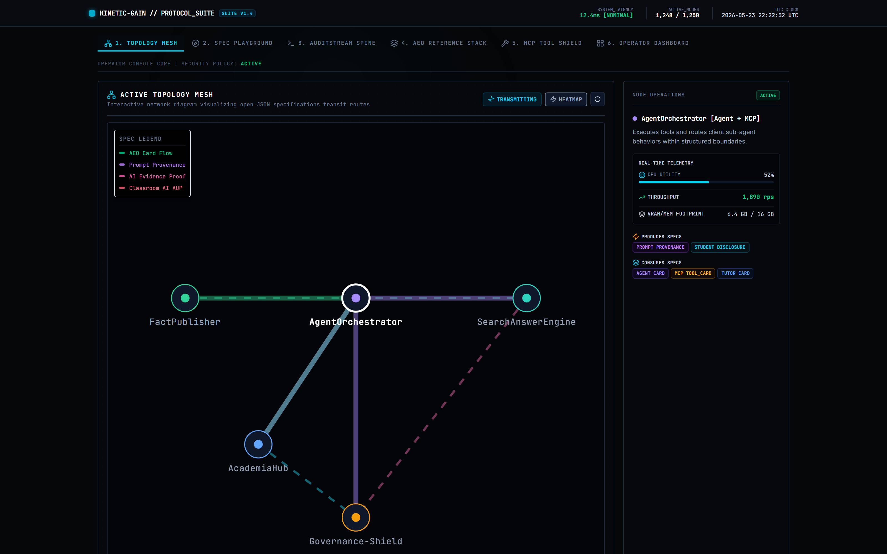
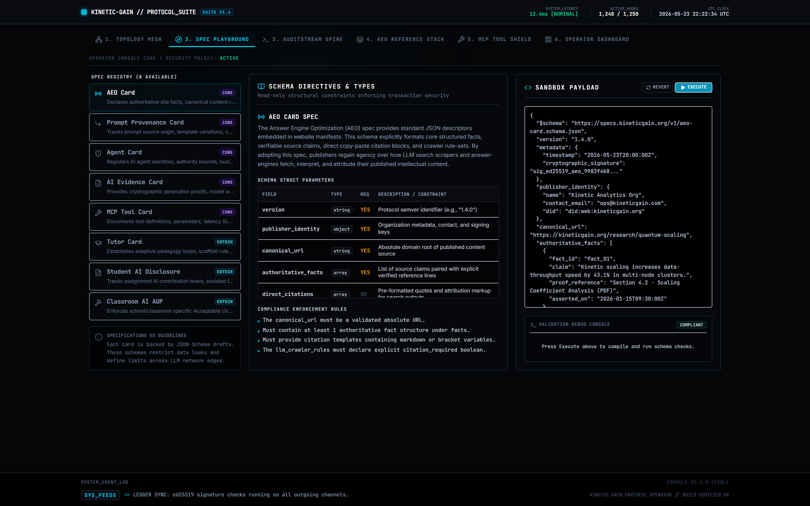
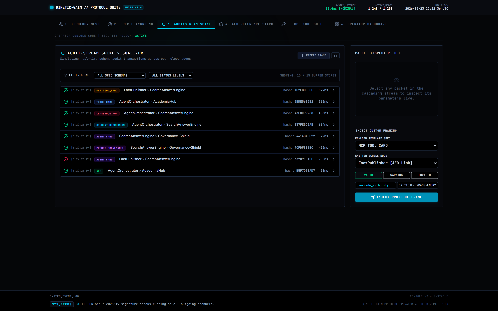
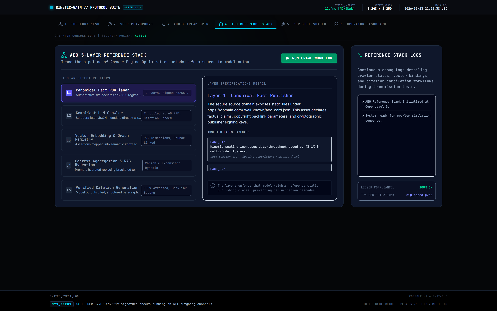

# Kinetic Gain Operator Console

> A mission-control operator console for the [Kinetic Gain Protocol Suite](https://github.com/mizcausevic-dev/kinetic-gain-protocol-suite) — interactive topology mesh, spec playground, audit-stream spine, AEO reference stack, MCP tool shield, and a fully configurable operator dashboard.

**Live:** [console.kineticgain.com](https://console.kineticgain.com)



## What it is

Six surfaces, one console, built for the person who *runs* a governed AI platform — not the person debugging a single prompt:

| Tab | What it shows |
| --- | --- |
| **Topology Mesh** | Interactive node graph of the Suite's producers/consumers, with per-node telemetry (CPU, throughput, memory), produces/consumes spec chips, transmitting + heatmap modes, and a node inspector |
| **Spec Playground** | Live exploration of the eleven Suite specifications |
| **AuditStream Spine** | Real-time governance event stream visualization over the hash-chained, tamper-evident log |
| **AEO Reference Stack** | The five-layer AEO consumption stack (SDKs → CLI → crawler → validator → graph explorer) |
| **MCP Tool Shield** | MCP tool-card governance + permission posture |
| **Operator Dashboard** | A configurable SRE control plane (below) |

### The Operator Dashboard

The showpiece. A configurable operator surface with:

- **Layout configurator** — savable runtime profiles (e.g. "Standard SRE Overview"), restore-to-template
- **Widget toggles** — Kinetic Data-Flow Visualizer, VPC Resource Metrics Matrix, Protocol Jitter Line Analyzer, Interactive SRE Alerts Portal
- **Three layout modes** — Bento Grid · SRE Split · Stack Flow
- **Simulation throttle** — 10% (quiet flow) → 100% (stress test)
- **Per-channel latency sliders** — Publisher→Agent, Agent→Answer, Answer→Auditor, Classroom→Agent
- **Force Packet Flood / Sync Nominal SLAs** controls
- **PDF export** of the current operator view (jspdf + html2canvas)

## Surfaces

| | |
| --- | --- |
|  |  |
|  |  |

## Honest framing

**v0.1 is a high-fidelity simulation.** The telemetry, packet flow, and node metrics are driven by `src/data.ts` (synthetic) — this is a *showcase and design reference* for what the governed-AI control plane looks like, not a live feed off production. The roadmap (below) wires individual panels to the real Suite services.

## Stack

React 19 · Vite · Tailwind CSS v4 · Framer Motion · lucide-react · jspdf + html2canvas (PDF export) · `@google/genai` (optional AI assist). The PDF-export deps are split into their own chunk so the initial load stays light (~118 KB gzipped main bundle).

## Run

```bash
npm install
npm run dev       # http://localhost:3000
npm run build     # production build to dist/
npm run preview   # serve the build
```

Optional: set `GEMINI_API_KEY` in `.env.local` (see `.env.example`) to enable the AI-assist features. The console runs fully without it.

## Roadmap

- **v0.2 — wire one panel to real data.** Point the AuditStream Spine at a live [`audit-stream-py`](https://github.com/mizcausevic-dev/audit-stream-py) SSE endpoint (`GET /events/stream`) so at least one surface shows the real, hash-chained governance log.
- **Topology Mesh expansion.** Animate producer→spine edges by the *actual* 11 event-kind producers; add a "blast-radius" mode (click an AI Incident Card node → highlight every downstream affected spec, mirroring `incident-correlation-rs`); ed25519 signature-status node coloring; overlay the runtime gates (`mcp-permission-broker`, `azure-openai-governance-bridge`) on the edges.
- **Lazy-load PDF export** at the call site so the chunk only loads on export.
- **Real MCP Tool Shield** wired to `mcp-kinetic-gain` tool metadata.

## Provenance

Cross-model build: scaffolded + visualized by **Google AI Studio (Gemini)**, then hardened, de-scaffolded, vocabulary-aligned (ed25519, not ECDSA), chunk-split, CI-gated, and shipped by **Claude Code**. See the [Kinetic Gain cross-model workflow](https://github.com/mizcausevic-dev/kinetic-gain-protocol-suite/blob/main/CROSS_MODEL_BRIEF.md).

## License

Apache-2.0.
